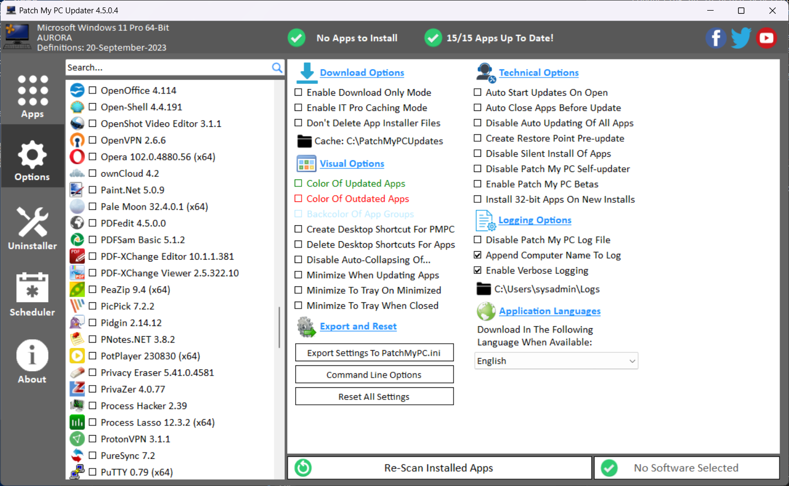
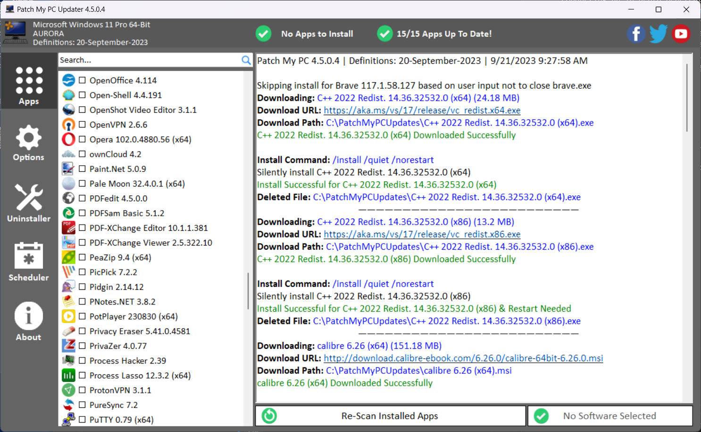
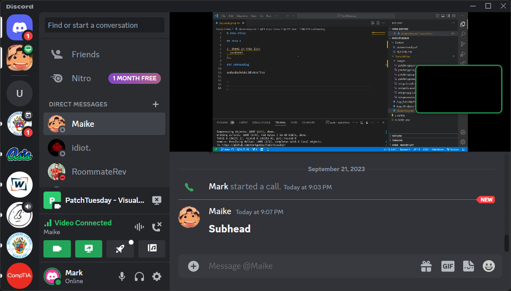
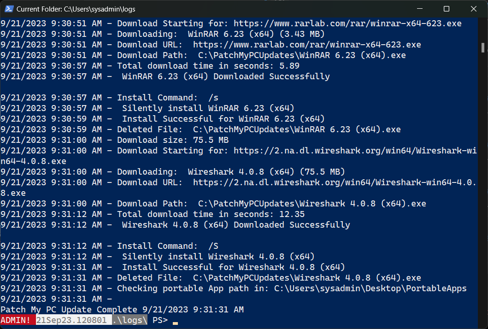

# PatchmyPC Home-Updater

:Warning:This application requires administrator privileges to function properly. Exercise caution.

Fantastic tool for automated patching and software updates for Windows users and sysadmins at home, and it's free. 

Full user guide here: https://www.youtube.com/watch?v=y5WWiWbO6v0&t=14s

## Enable Verbose Logging

Go to `Options`, then under the `Logging Options`:  
- Enable `Verbose Logging` 
- `Set Log location`, otherwise log will be created in  the same folder as the exe file. 

## Automated Patching with verbose output for monitoring

Starting:

Completed:

The output in the log matches the information from the GUI: 

